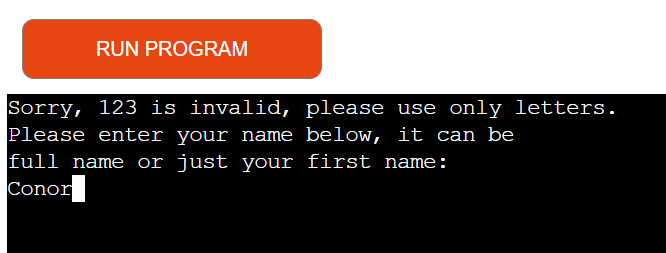
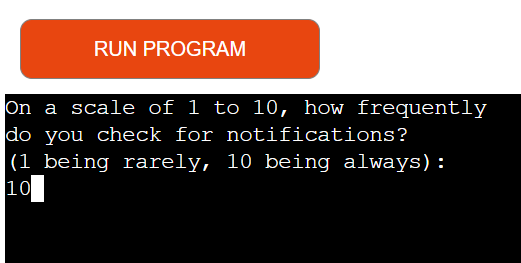
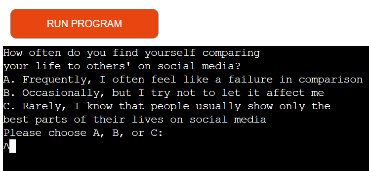
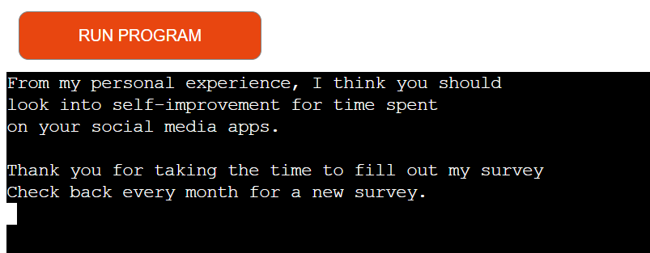
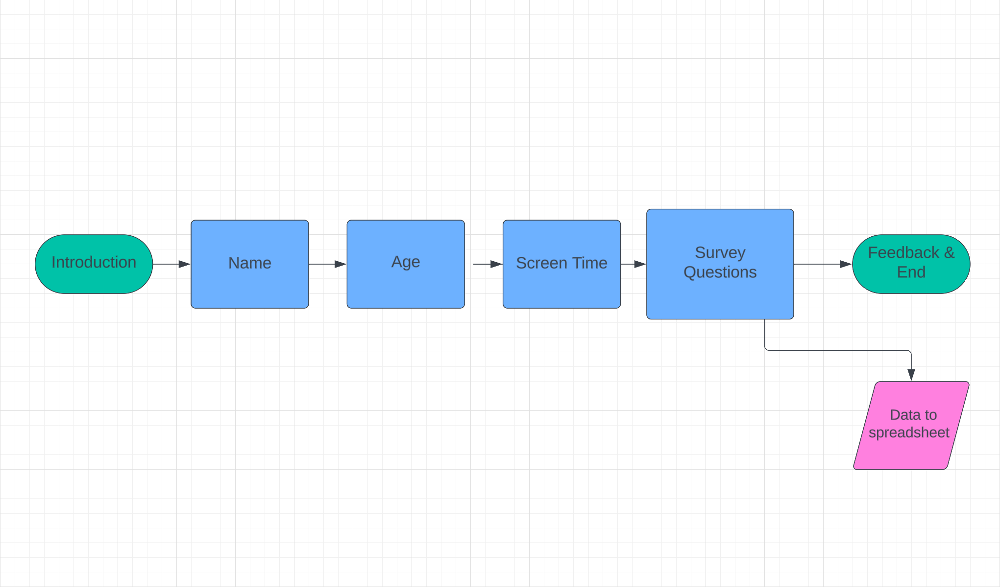

# [SOCIAL INSIGHTS](https://social-insights-5fd3e17a0651.herokuapp.com)

Welcome to Social Insights, a survey about Social Media and how it affects people. I made this survey to understand better how social media addiction impacts lives, especially since the pandemic. Many people, especially younger ones, seem to spend a lot of time on their phones instead of living in the real world.

At first, I've asked basic questions, but I plan to ask more detailed ones later to get better information.

Once I have enough data, I hope to figure out what's wrong with the internet today. It often feels like the internet controls us, our behaviour and shows us what it wants us to see based on algorithms.

## UX

My design process focused on creating a straightforward user experience by keeping the program's flow as linear as possible. Initially, users are prompted to provide essential information such as their name, age, and screen time. This will make for comparing/categorising easier in future development. Then from there the user will be asked questions with are somewhat categorised by how they operate, so I have implemented a couple of yes or no questions, then it leads onto the scale of 1-10 questions, then into the multiple choice questions which have been marked as A, B or C to answer.

## Features

### Existing Features

- ** Inputs **

    - Inputs are to be used to answer the questions, and they are also gated behind other functions to stop people from mis-answering questions e.g Numbers being used in the Name Question will loop so you have to answer appropriately.

- ** Scale Questions **

    - The Scale Questions are in junction with the Scale function to make sure you can answer with numbers 1 through 10 depending on your answer and making sure you cannot input any other way.

- ** Multiple Choice Questions **

    - Multiple choice questions allow the user to choose a different answer between the 3 given using A, B or C, to switch things up from the norm.

- ** Feedback **

    - The feedback feature is based on how you as a user answer the questions. If you are someone who answers based on a lot of usage of social media, it will feedback one way, same with the opposite and even a middle ground feedback.

### Future Features

-  Comparisons 
    - I would like to implement a way to compare how your answers based on your age compare with other people within your age bracket, e.g 19-24 year olds with 9 hour screen times but you have 2 hours.
-  Charts 
    - I'd like a way for people to access the API in a way where they can view peoples answers in averages between ages too, possibly within bar or pie charts.
-  Usage Tracker 
    - I would like to implement a way where users as well as myself can access how many people have gave answers over the entirety of the surveys lifetime.

## Tools & Technologies Used

-  used for version control. (`git add`, `git commit`, `git push`)
-  used for secure online code storage.
-  used as a cloud-based IDE for development.
-  used as the back-end programming language.
-  used for hosting the deployed back-end site.

## Data Model

### Flowchart

### Classes & Functions

The primary functions used on this application are:

- `clear()`
    - Clears the command line as the questions are being answered.
- `name()`
    - Creates a means of identifying the user further in the survey.
- `age()`
    - Creates a means of identifying age within the user.
- `sv_yesno()`
    - Prompts the user to respond with "yes" or "no". If the user's response does not match either "yes" or "no", it allows for re-prompting until a valid response is given.
- `sv_analysis()`
    - Analyzes every answer given by the user to be used for the feedback process later on.
- `sv_scale()`
    -  Displays a prompt to the user and allows a minimum and maximum value for use in questions.
- `main()`
    - Run all program functions.

### Imports

I've used the following Python packages and/or external imported packages.

- `gspread`: used with the Google Sheets API
- `google.oauth2.service_account`: used for the Google Sheets API credentials
- `os`: used for adding a `clear()` function

## Testing

> [!NOTE]  
> For all testing, please refer to the [TESTING.md](TESTING.md) file.

## Deployment

Code Institute has provided a [template](https://github.com/Code-Institute-Org/python-essentials-template) to display the terminal view of this backend application in a modern web browser.
This is to improve the accessibility of the project to others.

The live deployed application can be found deployed on [Heroku](https://social-insights-5fd3e17a0651.herokuapp.com).

### Heroku Deployment

This project uses [Heroku](https://www.heroku.com), a platform as a service (PaaS) that enables developers to build, run, and operate applications entirely in the cloud.

Deployment steps are as follows, after account setup:

- Select **New** in the top-right corner of your Heroku Dashboard, and select **Create new app** from the dropdown menu.
- Your app name must be unique, and then choose a region closest to you (EU or USA), and finally, select **Create App**.
- From the new app **Settings**, click **Reveal Config Vars**, and set the value of KEY to `PORT`, and the value to `8000` then select *add*.
- If using any confidential credentials, such as CREDS.JSON, then these should be pasted in the Config Variables as well.
- Further down, to support dependencies, select **Add Buildpack**.
- The order of the buildpacks is important, select `Python` first, then `Node.js` second. (if they are not in this order, you can drag them to rearrange them)

Heroku needs three additional files in order to deploy properly.

- requirements.txt
- Procfile
- runtime.txt

You can install this project's **requirements** (where applicable) using:

- `pip3 install -r requirements.txt`

If you have your own packages that have been installed, then the requirements file needs updated using:

- `pip3 freeze --local > requirements.txt`

The **Procfile** can be created with the following command:

- `echo web: node index.js > Procfile`

The **runtime.txt** file needs to know which Python version you're using:
1. type: `python3 --version` in the terminal.
2. in the **runtime.txt** file, add your Python version:
	- `python-3.9.18`

For Heroku deployment, follow these steps to connect your own GitHub repository to the newly created app:

Either:

- Select **Automatic Deployment** from the Heroku app.

Or:

- In the Terminal/CLI, connect to Heroku using this command: `heroku login -i`
- Set the remote for Heroku: `heroku git:remote -a app_name` (replace *app_name* with your app name)
- After performing the standard Git `add`, `commit`, and `push` to GitHub, you can now type:
	- `git push heroku main`

The frontend terminal should now be connected and deployed to Heroku!

### Local Deployment

This project can be cloned or forked in order to make a local copy on your own system.

For either method, you will need to install any applicable packages found within the *requirements.txt* file.

- `pip3 install -r requirements.txt`.

If using any confidential credentials, such as `CREDS.json` or `env.py` data, these will need to be manually added to your own newly created project as well.

#### Cloning

You can clone the repository by following these steps:

1. Go to the [GitHub repository](https://github.com/conor-timmis/Social-Insights) 
2. Locate the Code button above the list of files and click it 
3. Select if you prefer to clone using HTTPS, SSH, or GitHub CLI and click the copy button to copy the URL to your clipboard
4. Open Git Bash or Terminal
5. Change the current working directory to the one where you want the cloned directory
6. In your IDE Terminal, type the following command to clone my repository:
	- `git clone https://github.com/conor-timmis/Social-Insights.git`
7. Press Enter to create your local clone.

Alternatively, if using Gitpod, you can click below to create your own workspace using this repository.

Please note that in order to directly open the project in Gitpod, you need to have the browser extension installed.
A tutorial on how to do that can be found [here](https://www.gitpod.io/docs/configure/user-settings/browser-extension).

#### Forking

By forking the GitHub Repository, we make a copy of the original repository on our GitHub account to view and/or make changes without affecting the original owner's repository.
You can fork this repository by using the following steps:

1. Log in to GitHub and locate the [GitHub Repository](https://github.com/conor-timmis/Social-Insights)
2. At the top of the Repository (not top of page) just above the "Settings" Button on the menu, locate the "Fork" Button.
3. Once clicked, you should now have a copy of the original repository in your own GitHub account!

### Local VS Deployment

My Gitpod version of the project in comparison to my Heroku version has been somewhat tedious to measure up the text and what should and shouldn't be on each line. I have tried to make it in a way where it flows properly rather than always filling in the lines full of text when they are displayed.

## Credits

The forum Stackoverflow & W3schools were a massive help towards the editing of my function "screen_time" as I had written it originally to collect data in the survey, but I had found a post which helped with the writing of checking for numbers and decimals in every character of the users input. This I was stuck with originally and needed some support and looked around as much as I could.

### Content

| Source | Location | Notes |
| --- | --- | --- |
| [Markdown Builder](https://tim.2bn.dev/markdown-builder) | README and TESTING | tool to help generate the Markdown files |
| [Chris Beams](https://chris.beams.io/posts/git-commit) | version control | "How to Write a Git Commit Message" |
| [W3Schools](https://www.w3schools.com/python/ref_func_all.asp) | Python function | use of "all()" |
| [StackOverflow](https://stackoverflow.com/questions/49742938/checking-isdigit-on-python) | python function | use of "char.isdigit()" |

### Media

### Acknowledgements

- I would like to thank my Code Institute mentor, [Tim Nelson](https://github.com/TravelTimN) for his support throughout the development of this project and helping me with a few errors along the way.
- I would like to thank the [Code Institute](https://codeinstitute.net) tutor team for their assistance with troubleshooting and debugging some project issues.