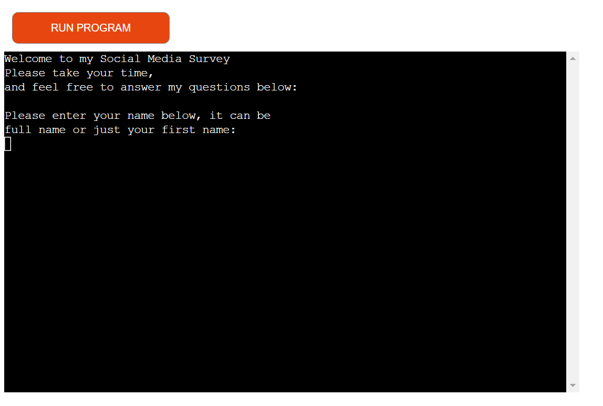

# [SOCIAL INSIGHTS](https://social-insights-5fd3e17a0651.herokuapp.com)

Welcome to Social Insights, a survey about Social Media and how it affects people. I made this survey to understand better how social media addiction impacts lives, especially since the pandemic. Many people, especially younger ones, seem to spend a lot of time on their phones instead of living in the real world.

At first, I've asked basic questions, but I plan to ask more detailed ones later to get better information.

Once I have enough data, I hope to figure out what's wrong with the internet today. It often feels like the internet controls us, our behaviour and shows us what it wants us to see based on algorithms.

## UX

My design process focused on creating a straightforward user experience by keeping the program's flow as linear as possible. Initially, users are prompted to provide essential information such as their name, age, and screen time. This will make for comparing/categorising easier in future development. Then from there the user will be asked questions with are somewhat categorised by how they operate, so I have implemented a couple of yes or no questions, then it leads onto the scale of 1-10 questions, then into the multiple choice questions which have been marked as A, B or C to answer.