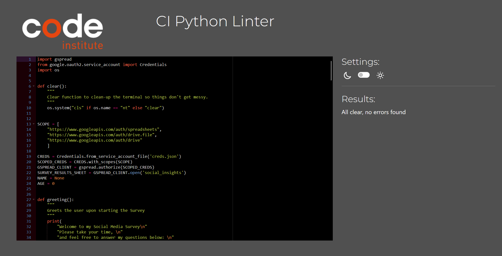

# Testing

> [!NOTE]  
> Return back to the [README.md](README.md) file.

Feature-by-Feature Testing:

- The Survey: Users can get from start to finish with a result at the end for how they should move going forward depending on how they have responded to the questions. I have put checks in place to make sure people can only give genuine responses, eg. scale of 1-10 questions can only be answered with 1-10 and not with letters or anything higher or lower. Throughout the survey, text is cleared per answer to make it easier for the user to read and respond to questions.

- Name, Age & Screen Time: I have implemented these in a way where they can be called throughout the survey, for example if I input a name and age, it will be called further on in the survey as information to feedback. For example, I have used Screen Time as a means to say the users input name and age and how they can progress further on and tested it to make sure everything is working and in order.

- Questions: With my questions, I have tried to make it vary where there are 2 of each variation. The variations are "Yes/No", "Scale of 1-10" and "Multiple Choice" questions. I have put checks in place so non-genuine answers cannot be entered and with that in mind gives a more genuine survey result overall. The answers are stored within my spreadsheet upon completion of the entire survey, and not posted if the spreadsheet is incomplete as in my mind it will only give worse results overall in the long-term. Once all of the answers are given within the survey, they are appended into the spreadsheet.

- Feedback: In place is a function to record the answers and calculate at the completion of the survey "how the user has answered" so to speak. If the user is answering the questions in a way where they seem overly addicted to social media, it will feedback with the answer I have written and have put into the function to give the user some advice in regards to that. It also works with a "middle ground" of answers, and a "non-addicted" set of answers to feedback with. It will try to be as accurate as possible depending on even the most varied of answers given.

User Experience Testing:

I have had a couple of friends briefly test my page, below are the feedbacks they gave me:

- TJ: I found the survey easy enough to get through. The instructions from each question were clear, and answering them in the correct way was easy enough to follow from the question itself. I didn't recognise any issues with the program itself.

- Brad: I found the survey easy to navigate and complete. The instructions were clear, I didn't have any issues understanding the questions. However, I would like to suggest adding a progress indicator to let users know how far along they are in the survey.

Regression Testing:

After implementing fixes and updates, I have ensured that features current old and new are working as intended, as I did not want to push the end result as broken.

Documentation and Logs:

- Declare which packages will be necessary initially.
- Wrote functions with prints making sure all of them work as intended.
- Check with the use of newly written functions that they will append to the spreadsheet.
- Implemented use of {name} & {age} functionality so the data is reused and more interactive throughout the survey.
- Wrote actual questions to replace the placeholder ones I originally wrote for testing.
- Added checks to the questions to make sure answers were kept genuine as possible.
- Tested the functionality of everything through out so far.
- Implemented a clear function (as well as the "os" package) as advised by my mentor to clear the page as the questions are answered to make it more visually appealing.
- Started necessary testing to make sure everything was in order, found a few issues with indentations after not testing for a while and fixed all of those. 
- Fixed everything minor with the use of PEP8 checker, had to go back again and double check once final Docstrings were written and certain lines felt out of place, fixed all after a few issues all had with indentation.

## Code Validation

### JavaScript

I have used the recommended [JShint Validator](https://jshint.com) to validate all of my JS files.

### Python

I have used the recommended [PEP8 CI Python Linter](https://pep8ci.herokuapp.com) to validate all of my Python files.

| Directory | File | CI URL | Screenshot | Notes |
| --- | --- | --- | --- | --- |
|  | run.py | [PEP8 CI](https://pep8ci.herokuapp.com/https://raw.githubusercontent.com/conor-timmis/Social-Insights/main/run.py) |  | "All clear, no errors found" |
