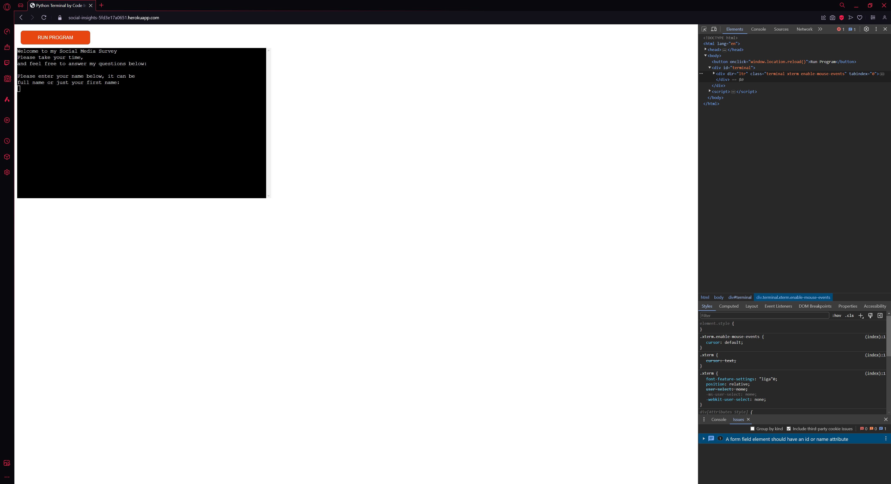
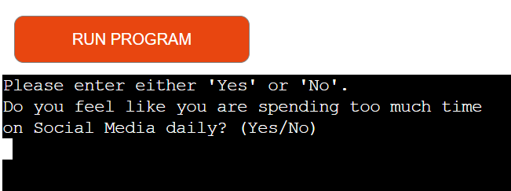

# Testing

> [!NOTE]  
> Return back to the [README.md](README.md) file.

Feature-by-Feature Testing:

- The Survey: Users can get from start to finish with a result at the end for how they should move going forward depending on how they have responded to the questions. I have put checks in place to make sure people can only give genuine responses, eg. scale of 1-10 questions can only be answered with 1-10 and not with letters or anything higher or lower. Throughout the survey, text is cleared per answer to make it easier for the user to read and respond to questions.

- Name, Age & Screen Time: I have implemented these in a way where they can be called throughout the survey, for example if I input a name and age, it will be called further on in the survey as information to feedback. For example, I have used Screen Time as a means to say the users input name and age and how they can progress further on and tested it to make sure everything is working and in order.

- Questions: With my questions, I have tried to make it vary where there are 2 of each variation. The variations are "Yes/No", "Scale of 1-10" and "Multiple Choice" questions. I have put checks in place so non-genuine answers cannot be entered and with that in mind gives a more genuine survey result overall. The answers are stored within my spreadsheet upon completion of the entire survey, and not posted if the spreadsheet is incomplete as in my mind it will only give worse results overall in the long-term. Once all of the answers are given within the survey, they are appended into the spreadsheet.

- Feedback: In place is a function to record the answers and calculate at the completion of the survey "how the user has answered" so to speak. If the user is answering the questions in a way where they seem overly addicted to social media, it will feedback with the answer I have written and have put into the function to give the user some advice in regards to that. It also works with a "middle ground" of answers, and a "non-addicted" set of answers to feedback with. It will try to be as accurate as possible depending on even the most varied of answers given.

User Experience Testing:

I have had a couple of friends briefly test my page, below are the feedbacks they gave me:

- TJ: I found the survey easy enough to get through. The instructions from each question were clear, and answering them in the correct way was easy enough to follow from the question itself. I didn't recognise any issues with the program itself.

- Brad: I found the survey easy to navigate and complete. The instructions were clear, I didn't have any issues understanding the questions. However, I would like to suggest adding a progress indicator to let users know how far along they are in the survey.

Regression Testing:

After implementing fixes and updates, I have ensured that features current old and new are working as intended, as I did not want to push the end result as broken.

Documentation and Logs:

- Declare which packages will be necessary initially.
- Wrote functions with prints making sure all of them work as intended.
- Check with the use of newly written functions that they will append to the spreadsheet.
- Implemented use of {name} & {age} functionality so the data is reused and more interactive throughout the survey.
- Wrote actual questions to replace the placeholder ones I originally wrote for testing.
- Added checks to the questions to make sure answers were kept genuine as possible.
- Tested the functionality of everything through out so far.
- Implemented a clear function (as well as the "os" package) as advised by my mentor to clear the page as the questions are answered to make it more visually appealing.
- Started necessary testing to make sure everything was in order, found a few issues with indentations after not testing for a while and fixed all of those. 
- Fixed everything minor with the use of PEP8 checker, had to go back again and double check once final Docstrings were written and certain lines felt out of place, fixed all after a few issues all had with indentation.

## Code Validation

### Python

I have used the recommended [PEP8 CI Python Linter](https://pep8ci.herokuapp.com) to validate all of my Python files.

| Directory | File | CI URL | Screenshot | Notes |
| --- | --- | --- | --- | --- |
|  | run.py | [PEP8 CI](https://pep8ci.herokuapp.com/https://raw.githubusercontent.com/conor-timmis/Social-Insights/main/run.py) |  | "All clear, no errors found" |

## Browser Compatibility

I've tested my deployed project on multiple browsers to check for compatibility issues.

| Browser | Home | Notes |
| --- | --- | --- |
| Chrome |  | "Warning: A form field element should have an id or name attribute" (Not related to Python code though) |
| Edge |  | Few issues relating to Javascript used for my page |
| Firefox |  | No Compatibility issues found. |
| Opera GX |  | "Warning: A form field element should have an id or name attribute" & Missing Favicon Error. |

## Responsiveness

I've tested my deployed project on multiple devices to check for responsiveness issues.

| Device | Home | Notes |
| --- | --- | --- |
| Mobile (DevTools) |  | Fits within the screen although much smaller |
| Tablet (DevTools) |  | Fits within the screen although much smaller |
| Desktop |  | Works as expected |
| XL Monitor |  | Works as expected |
| 4K Monitor |  | Works as expected |

## Lighthouse Audit

I've tested my deployed project using the Lighthouse Audit tool to check for any major issues.

| Page | Screenshot | Notes |
| --- | --- | --- |
| Home |  | Performance is good overall, files unrelated to my page are mentioned by Lighthouse |

## Defensive Programming

- Users must enter a valid letter/word/string when prompted, if they don't, the question will be asked again and the user will be prompted with what kind of answer the question is looking for.
- Users are prompted to use only the answers mentioned after the question, I have used "Yes" or "No", Scale of 1-10 and multiple choice questions to bring variety and included numerous kinds of checks.
- When testing, I tried to make sure I tried varieties of ways to "bug" the answer through, such as trying answers with different symbols as well as letters or numbers depending on question.

Defensive programming was manually tested with the below user acceptance testing:

| Page | Expectation | Test | Result | Fix | Screenshot |
| --- | --- | --- | --- | --- | --- |
| Home | Name function is for storing the name input when asked | Tested the feature entering my name when asked | The feature behaved as expected, and it displayed my name as part of the age function | Test concluded and passed |  |
| Home | Age is built to store the age input | Tested the feature by entering my age when asked in the survey | The feature behaved as expected, and it displayed my age long with my name | Test concluded and passed |  |
| Home | Screen Time is expected to only allow decimals or numbers | Tested the feature by typing "hello" | The feature behaved as expected, and it blocked my input of letters | Test concluded and passed |  |
| Home | Yes or No is expected to stop and loop the question if answered incorrectly | Tested the feature by typing "test" instead of "yes" or "no" | The feature behaved as expected, and it stopped me and looped the question | Test concluded and passed |  |
| Home | Multiple choice is expected to only allow "A" "B" or "C" answers | Tested the feature by typing "D" | The feature behaved as expected, the question looped instead of allowing a pass through the question | Test concluded and passed |  |
| Home | Feedback is expected to operate once the user finished the survey | Tested the feature by answering all questions | The feature behaved as expected, and it displayed the appropriate feedback message based on the answers I gave | Test concluded and passed |  |

## Bugs

- One bug I faced was (not so much a bug) but a rendering issue I would call it and that was how the words wrapped within the display box on Heroku as opposed to the command line in Gitpod or Visual Studio Code (rarely used) as they wrap automatically and the Heroku version does not it was making the judgement of where to format each line a little tricky.

- Another bug I faced was when I was initially writing the code, and this was to do with data integrity, my answers given would be incorrect in a way where it would skip boxes or append vertically rather than horizontally, but as I am new to Python entirely I had to look up how to append the correct way in order to have them display under the right headings within my spreadsheet. 

- I had many errors found by PEP8, a lot of them being "X line too long" which I have already fixed at this point but it was interesting to see that I had around 15-20 of them as someone who doesn't really know Python too well, and even found some indentation errors which were all quite simple to fix and made it easier to follow the etiquette of the language later on.

## Unfixed Bugs

I am not currently aware even after testing of any bugs.
